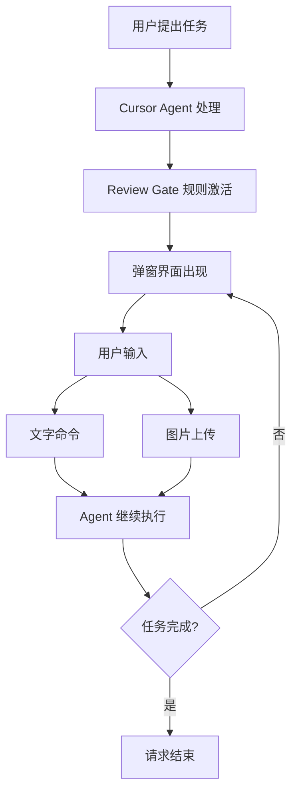

[](https://freeimage.host/i/3OtOp7R)

# Review Gate

Cursor IDE 的 MCP 集成交互控制系统。

> 原作者：[Lakshman Turlapati](https://github.com/LakshmanTurlapati/Review-Gate)  
> 中文汉化：Chuan  
> 当前版本：2.7.3-cn.4（基于原版 2.7.3）

[](https://github.com/LakshmanTurlapati/Review-Gate)
[](LICENSE)
[]()
[](https://modelcontextprotocol.io/)


## 项目简介

Review Gate 解决了 Cursor AI 经常过早结束任务的问题。通过引入交互式检查点，让用户在单次请求的生命周期内完成更复杂的任务，充分利用每次请求的工具调用配额。

## 中文版更新内容

### 2.7.3-cn.4
- 禁用语音功能（Cursor webview 安全限制）
- 优化输入框布局
- 调整版本号策略（基于原版 2.7.3）
- 采用 Cursor Skills 架构替代 mdc 规则

### 2.7.3-cn.3
- 实现多窗口隔离机制
- 基于 workspace 路径的 MD5 哈希文件隔离

### 2.7.3-cn.2
- 修复 MCP 依赖问题
- 修复 UTF-8 编码问题
- 更改快捷键为 `Ctrl+Alt+G`
- 调整超时时间为 60 分钟

### 2.7.3-cn.1
- 中文界面本地化

## 功能特性

| 功能 | 说明 |
|------|------|
| MCP 集成 | 与 Cursor Agent 无缝交互 |
| 图片上传 | 支持截图和多格式图片 |
| 多窗口隔离 | 每个 Cursor 窗口独立工作 |
| 中文界面 | 完整的本地化支持 |
| 长时超时 | 60 分钟响应等待时间 |

## 架构设计



## 安装说明

### 一键安装

```powershell
git clone https://github.com/LakshmanTurlapati/Review-Gate.git
cd Review-Gate
./install.ps1
```

安装脚本自动处理：
- 依赖项安装（Python 包）
- MCP 服务器配置
- Cursor 扩展安装
- 配置文件合并（不覆盖现有配置）

### 手动安装

1. 下载 `cursor-extension/review-gate-v2-2.7.3-cn.4.vsix`
2. 打开 Cursor → 按 `Ctrl+Shift+X`
3. 点击 `...` 菜单 → "从 VSIX 安装..."
4. 选择下载的文件并重启 Cursor

### 配置 Cursor Skills 规则

Review Gate 使用 Cursor Skills 架构进行规则配置。

**设置方法**：
1. 在项目根目录创建 `.cursor/skills/review-gate/SKILL.md`
2. 复制 `.cursor/skills/review-gate/SKILL.md` 的内容

**SKILL 架构优势**：
- 项目级别的规则隔离
- 自动传递 `workspace_path` 参数
- 支持多窗口独立工作

## 使用方法

### 快捷键

`Ctrl+Alt+G` - 手动触发 Review Gate 弹窗

### 基本流程

1. 给 Cursor 分配任务
2. Agent 处理后调用 `review_gate_chat` 工具
3. 弹窗出现，输入后续指令或上传图片
4. Agent 继续执行
5. 重复步骤 3-4 直到任务完成
6. 输入 `TASK_COMPLETE` 结束会话

## 多窗口支持

系统通过 workspace 路径的 MD5 哈希值实现窗口隔离：

```
窗口1 (E:\ProjectA)              窗口2 (E:\ProjectB)
hash = abc12345                  hash = def67890
    │                                │
    ▼                                ▼
trigger_abc12345.json            trigger_def67890.json
response_abc12345_xxx.json       response_def67890_xxx.json
```

使用要求：
- 项目需配置 SKILL 规则文件（`.cursor/skills/review-gate/SKILL.md`）
- Agent 调用时传递 `workspace_path` 参数

## 故障排除

```powershell
# 检查 MCP 服务器日志
type %TEMP%\review_gate_v2.log

# 验证 MCP 配置
type %USERPROFILE%\.cursor\mcp.json

# 手动触发弹窗
# 在 Cursor 中按 Ctrl+Alt+G
```

## 已知限制

- 语音输入功能暂不可用（Cursor webview 安全限制）
- 仅支持 Windows 平台（其他平台未经测试）

## 致谢

感谢原作者 [Lakshman Turlapati](https://www.audienclature.com) 创建了 Review Gate 项目。
